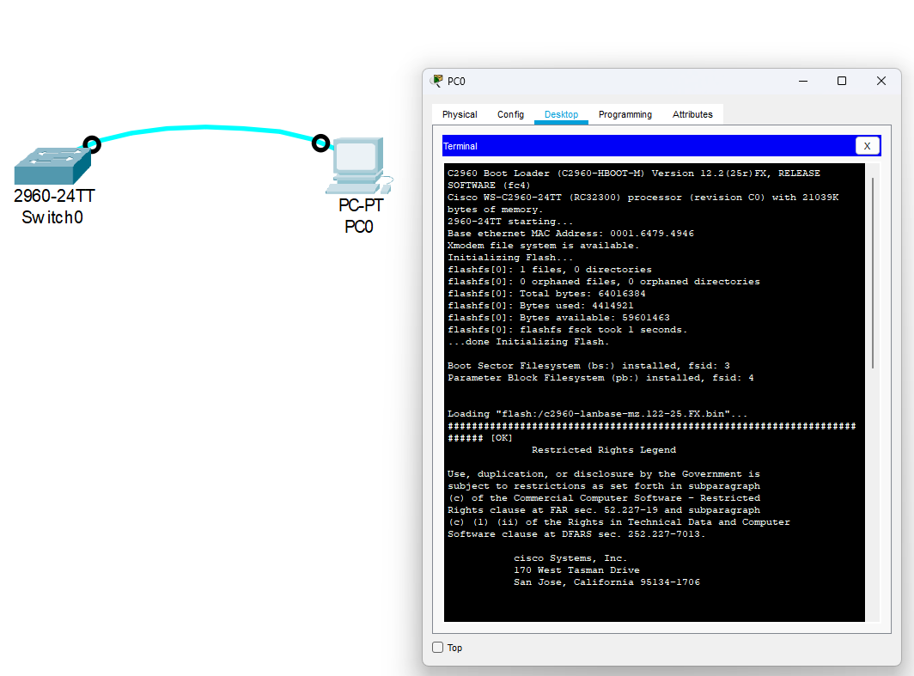

## Лабораторная работа. Базовая настройка коммутатора 

### Топология

### Таблица адресации

<table>
  <tr>
    <th style="text-align: center;">Устройство</th>
    <th style="text-align: center;">Интерфейс</th>
    <th style="text-align: center;">IP-адрес / префикс</th>
  </tr>
  <tr>
    <td rowspan="3" style="text-align: center">Switch1</td>
    <td rowspan="3" style="text-align: center">Vlan1</td>
    <td style="text-align: center">192.168.1.2/24</td>
  </tr>
  <tr>
    <td></td>
  </tr>
  <tr>
    <td></td>
  </tr>
  <tr>
    <td rowspan="3" style="text-align: center">PC-ACC</td>
    <td rowspan="3" style="text-align: center">NIC</td>
    <td style="text-align: center">192.168.1.2/24</td>
  </tr>
   <tr>
    <td></td>
  </tr>
  <tr>
    <td></td>
  </tr>
</table>

### Цели работы
#### Часть 1. Проверка конфигурации коммутатора по умолчанию
#### Часть 2. Создание сети и настройка основных параметров устройства
* Настройка базовых параметров коммутатора 
* Настройка базовых параметров ПК доступа 
#### Часть 3. Проверка сетевых подключений
* Отбразить конфигурацию устройства
* Протестировать сквозное соединение, отправив эхо-запрос. 
* Протестировать возможности удаленного управления с помощью Telnet.

### Выполнение работы
#### Часть 1. Создание сети и проверка настроек коммутатора по умолчанию
##### Шаг 1. Создаем сеть согласно топологии

 а. Подключаем консольный кабль согласно топологии.
  
 б. Подключаемся через терминал PC к коммутатору

 

 Вопрос: почему нужно использовать консольные подключения для первоначальной настройки коммутатора? Почему нельзя подключиться к коммутатору через Telnet или SSH?

 Ответ: для подключения к SSH или Telnet необходимо сперва настроить каналы VTY для удаленного управления, которые по умолчанию в коммутаторе не сконфигурированы. 
 

##### Шаг 2. Проверяем настройки коммутатора по умолчанию. 
a. Проверяем текущий running-config.

Настроенных паролей или адресов интерфейсов нет, конфигурация стоит по умолчанию. 

b. Изучаем текущий файл конфигурации. 

У коммутатора CISCO 2960 24 порта FastEthernet, 2 порта Gigabit Ethernet, до 16 настраеваемых вирутальных каналов VTY (диапазон значений от 0 до 15).

c. Изучаем файл загрузочной конфигурации (startup-configuration)

Выполняем команду:
>show startup-config

В ответ получаем сообщение

>startup-config is not present

Это связано с тем, что в настоящий момент в NVRAM нет сохраненного файла конфигурации. Чтобы он там появился необходимо сохранить текущий running-config в файл загрузочной конфигурации. 

d. Изучаем характеристики SVI  для VLAN 1

Выполняем команду:

>show interface vlan 1

Получаем сообщение:

>Vlan1 is administratively down, line protocol is down

Из этого следует, что интерфейс сейчас не включен и ip адрес для него также не настроен. 

e. Изучаем свойства IP интерфейса vlan 1

Вводим команду:

>show ip interface vlan 1

Получаем ответ:

>Vlan1 is administratively down, line protocol is down
Internet protocol processing disabled

IP не настроен, порт выключен. 

f. Подсоединим кабель Ethernet к порту FastEthernet 0/6 и изучим свойства интерфейса Vlan 1.

После подключения кабеля и согласования скоростей характеристики Vlan 1 не поменялись. 

g. Изучаем сведение об ОС Сisco на коммутаторе. 

Для того, чтобы получить информацию об ОС перезагрузим коммутатор командой Reload 

Во всплывающей информацию о коммутаторе будет следующая строка:

>Cisco IOS Software, C2960 Software (C2960-LANBASE-M), Version 12.2(25)FX, RELEASE SOFTWARE (fc1)

Это и есть версия ОС

Название файла образа системы можно получить, если применить в режиме EXEC команду dir.

i. Изучение флеш-памяти. 

В данный момент на флеш-памяти есть только образ системы, его название

>c2960-lanbase-mz.122-25.FX.bin

#### Часть 2. Настройка базовых параметров сетевых устройств

##### Шаг 1. 

a. Заходим в режим глобальной конфигурации из режима EXEC (команда conf t)

Вводим следующие строчки кофигурации

%При вводе не верной команды не выполнять dns lookup
>no ip domain-lookup

%Поменять наименования коммутатора на S1
>hostname S1

%Хранить пароли в конфигурации в закодированном виде
>service password-encryption

%Поставить пароль на переход в режим EXEC
>enable secret class

%Сделать баннер при начале работы с коммутатором (сообщение заключено между двумя "#")
>banner motd #
>Unauthorized access is strictly prohibited. #

b. Назначаем IP адрес для интерфейса Vlan 1

Переходим в режим глобальной конфигурации, далее в режим конфигурации интерфейса Vlan 1

>S1(config)#interface vlan 1

%Назначаем IP адрес интерфейсу согласно таблице адресации
>ip address 192.168.1.2 255.255.255.0

%Активируем интерфейс 
>no shotdown 

%Выходим из конфигурации интерфейса
>exit 

c. Задаем пароль для подключения к коммутатору через консоль 

%Из режима глобальной конфигурации переходим в режим настройки консоли 
>line console 0

%Вводим пароль cisco
>password cisco\
login

Для тоо, чтобы консольные сообщения не прерывали выполнения команд вводим следующий параметр

>logging synchronous

d. Настраевыем каналы vty 0 4 для подключения к коммутатору через telnet

%Из режима глобальной конфигурации переходим в режим настройки каналов vty
>line vty 0 4\
password class\
login

##### Шаг 2. Ставим IP адрес для PC-A согласно таблице адресации 

#### Часть 3 проверяем сетевые подключения

##### Шаг 1. Отображаем конфигурацию нашего коммутатора 

Конфигурация доступна в файле Switch0_running-config.txt

##### Шаг 2. Через командную строку проверяем доступность назначенных адресов

>C:\>ping 192.168.1.10\
Pinging 192.168.1.10 with 32 bytes of data:\
Reply from 192.168.1.10: bytes=32 time=2ms TTL=128\
Reply from 192.168.1.10: bytes=32 time=7ms TTL=128\
Reply from 192.168.1.10: bytes=32 time=6ms TTL=128\
Reply from 192.168.1.10: bytes=32 time=6ms TTL=128\
Ping statistics for 192.168.1.10:\
    Packets: Sent = 4, Received = 4, Lost = 0 (0% loss),\
Approximate round trip times in milli-seconds:\
    Minimum = 2ms, Maximum = 7ms, Average = 5ms\
C:\>ping 192.168.1.2\
Pinging 192.168.1.2 with 32 bytes of data:\
Request timed out.\
Reply from 192.168.1.2: bytes=32 time<1ms TTL=255\
Reply from 192.168.1.2: bytes=32 time<1ms TTL=255\
Reply from 192.168.1.2: bytes=32 time<1ms TTL=255\
Ping statistics for 192.168.1.2:\
    Packets: Sent = 4, Received = 3, Lost = 1 (25% loss),\
Approximate round trip times in milli-seconds:\
    Minimum = 0ms, Maximum = 0ms, Average = 0ms\

Адреса доступны

##### Шаг 3. Подключаемся к коммутатору S1 Через telnet

%Вводим через командную строку 

>C:\>telnet 192.168.1.2

Вводим пароль "cisco" и попадаем в окно работы с терминалом. 

%В режиме EXEC сохраняем текущую конфигурацию в стартовую с помощью команды copy

>copy running-config startup-config 

%После сохранения, выходим из telnet 
>exit

Настройка коммутатора завершена

### Вопросы для повторения 

1. Зачем необходимо настраивать пароль VTY для коммутатора?

Без пароля к коммутатору нельзя будет удаленно подключиться через telnet или ssh, так как  

2. Что нужно сделать, чтобы пароли не отправлялись в незашифрованном виде?

Для этого в режиме глобальной конфигурации необходимо прописать "service password-encryption"